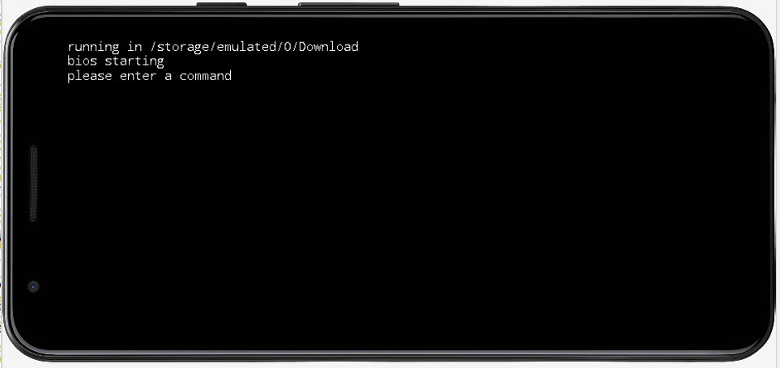

### UPDATE : the latest version is available here : [github.com/robertapengelly/Pdos-PdAndro](https://github.com/robertapengelly/Pdos-PdAndro)

# Android armeabi-v7a (32bit ARM) apk for [PDOS](https://pdos.org)

The source code is Public Domain except the gradle directory and gradlew.*

## The application works best with a hardware keyboard attached to your smartphone.

This app will create 2 files in your "Download/" folder (hi.txt and pcomm.arm)





## Modify an APK


Script to modify an Android APK under Debian :
```
echo sudo apt install zip apksigner zipalign

echo download bcprov-*.jar
firefox https://www.bouncycastle.org/download/bouncy-castle-java/

cp app-release.apk original.zip
rm -rf ./app
unzip original.zip -d app
echo assume that the new files are in the ./new directory
cp -r ./new/* ./app/

(cd app && zip --exclude resources.arsc -r ../app.zip * && zip -0 ../app.zip resources.arsc)
 
mv app.zip app_tmp.apk

if [ ! -f cert.bks ]; then
 keytool -genkey -keyalg RSA -alias cert -keystore cert.bks -storepass 12345678 -validity 36000 -storetype BKS -provider org.bouncycastle.jce.provider.BouncyCastleProvider -providerpath ~/Downloads/bcprov-jdk18on-1.78.1.jar
fi

rm -f app.apk

zipalign -p 4 app_tmp.apk app.apk

echo PASSWORD is 12345678
apksigner sign --min-sdk-version 16 --ks cert.bks app.apk

apksigner verify app.apk

```

